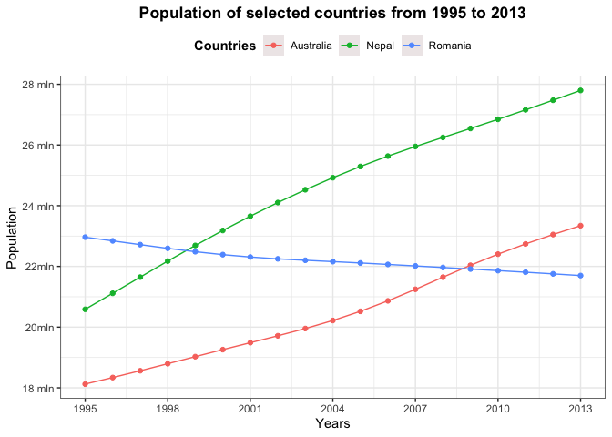
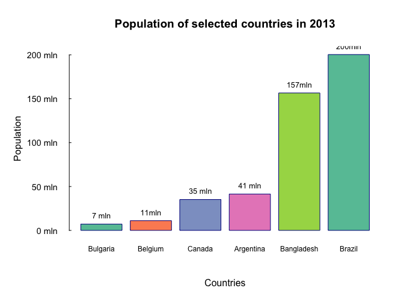
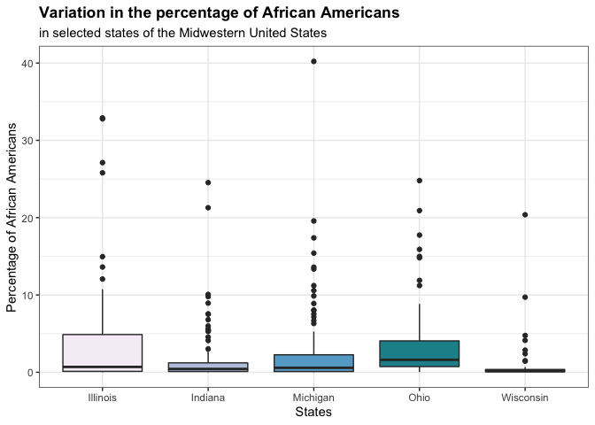
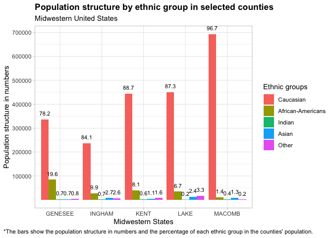
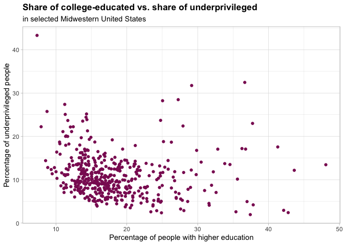
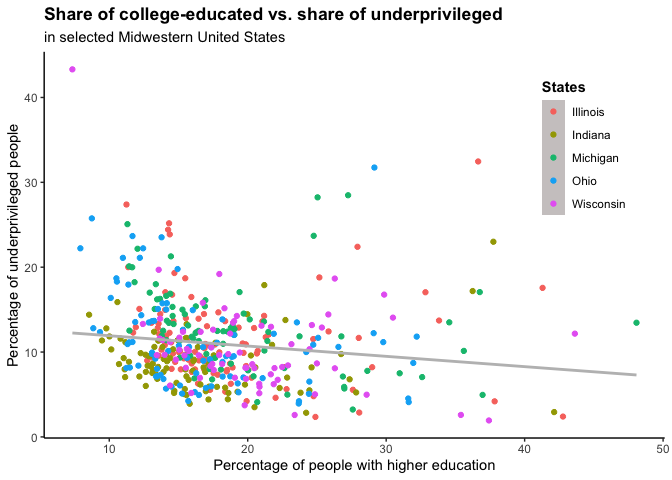

Data visualizations of demographic data using R
================

These visualizations were prepared using different approaches and R
packages. The goal was to explore some differences in populations in
countries across the world.

## Set up

First, turn off scientific notation.

``` r
options(scipen = 999)
```

Then, activate all packages (previously they could be installed with
install.packages(’’)).

``` r
library(tidyr)
library(dplyr)
library(ggplot2)
library(ggrepel)
library(RColorBrewer)
library(reshape2)
library(data.table)
```

## Explore data

Explore population data from tidyr package.

``` r
data <- tidyr::population
summary(data)
```

    ##    country               year        population        
    ##  Length:4060        Min.   :1995   Min.   :      1129  
    ##  Class :character   1st Qu.:1999   1st Qu.:    602919  
    ##  Mode  :character   Median :2004   Median :   5318854  
    ##                     Mean   :2004   Mean   :  30033440  
    ##                     3rd Qu.:2009   3rd Qu.:  18554162  
    ##                     Max.   :2013   Max.   :1385566537

## The population of selected countries from 1995 to 2013

Let’s use a line plot to compare changes in population in the years
1995-2013 in Australia, Romania, and Nepal.

``` r
countries <- data %>% filter(country %in% c("Romania", "Australia", "Nepal")) 
countries$country <- as.factor(countries$country)


ggplot(countries, aes(x=year, y=population, color=country))+
    geom_line()+
    geom_point()+
    scale_x_continuous(breaks = seq(1995, 2013, by=3))+
    scale_y_continuous(breaks = c(18000000, 20000000, 22000000, 24000000, 
                                  26000000, 28000000), 
                       labels= c('18 mln', '20mln', "22mln", '24 mln', 
                                 '26 mln', '28 mln'))+
    theme_bw()+
    labs(title = "Population of selected countries from 1995 to 2013", x="Years", 
         y="Population")+ 
    scale_colour_discrete("Countries")+ 
    theme(plot.title = element_text(hjust = 0.5, face = "bold"), 
          legend.position = "top", 
          legend.title = element_text(face="bold"),
          legend.key = element_rect(colour = "transparent", fill = "snow2"))
```

<!-- -->

#### The plot shows that the population of Australia and Nepal experienced considerable growth.

#### Contrarily, the population of Romania steadily declined.

## The population of selected countries in 2013

Let’s compare the population of Canada, Bangladesh, Argentina, Belgium,
Brazil, and Bulgaria in 2013 with bar plot.

``` r
countries2 <- data %>% filter(country %in% c("Canada", "Bangladesh","Argentina", "Belgium", "Brazil",  "Bulgaria"), year==2013)
countries2 <- countries2[order(countries2$population),]

coul <- brewer.pal(5, "Set2")
par(bg="white")
par(mar = c(5, 6, 4, 2), mgp=c(4, 1, 0), las=1)
xx <- barplot(countries2$population, names.arg=countries2$country, xlab='Countries',
              ylab= 'Population', main='Population of selected countries in 2013', 
              col=coul, col.axis="black", ylim = c(0,210000000), 
              cex.axis=1, cex.names=0.75, col.lab="black", 
              border = "dark blue", axes=FALSE, col.main="black")
text(x = xx, y = countries2$population, label = c('7 mln', '11mln', '35 mln', 
                                                  '41 mln', '157mln', '200mln'),
    pos = 3, cex = 0.8, col = "black")
axis(side=2,at=c(0, 50000000, 100000000, 150000000, 200000000),labels=c("0 mln",
    "50 mln","100 mln", '150 mln', '200 mln'), tck=.01, cex.axis=0.9, srt=45, 
    col.axis='black', col = "black", las=2)
```

<!-- -->

#### Brazil had the biggest population and Bulgaria had the lowest among selected countries in 2013.

## Variation in the percentage of African Americans in selected states of the Midwestern United States.

``` r
data <- ggplot2::midwest
data$state <- as.factor(data$state)
levels(data$state) <-c("Illinois", "Indiana", "Michigan", "Ohio", "Wisconsin")

ggplot(data, aes(x=state, y=percblack, fill=state))+
  geom_boxplot()+
  theme_bw()+
  labs(title="Variation in the percentage of African Americans", 
       subtitle = "in selected states of the Midwestern United States") + 
  xlab("States") + 
  ylab("Percentage of African Americans")+
  theme(legend.position = "none", 
        plot.title = element_text(face = "bold"))+
        scale_fill_brewer(palette="PuBuGn")
```

<!-- -->

## The population structure by ethnic group in selected counties of the United States

``` r
data <- ggplot2::midwest
data5<- data %>% select("county", "popwhite", "popblack", "popamerindian", 
                        "popasian", 
                        "popother")  %>% filter(county %in% c("LAKE", "GENESEE", 
                                                              "INGHAM", "KENT", 
                                                              "MACOMB")) 
data5 <- data5[-c(2,6,8), ]
long5 <- melt(setDT(data5), id.vars = c("county"), variable.name="race", 
              value.name = "value_by_race")
data_add <- data %>% select("county", "percwhite", "percblack", "percamerindan",
                            "percasian", 
                        "percother")  %>% filter(county %in% c("LAKE","GENESEE",
                                                               "INGHAM", "KENT", 
                                                               "MACOMB")) 
data_add <- data_add[-c(2,6,8), ]
long_add <- melt(setDT(data_add), id.vars = c("county"), variable.name="race", 
                 value.name = "perc_by_race") 
df <- cbind(long5, long_add)
df <- df[, -c(4,5)]
options(scipen = 999)

ggplot(data = df, aes(x = county, y = value_by_race, fill = race)) +
  geom_histogram(stat = "identity", position = "dodge") +
  labs(title = "Population structure by ethnic group in selected counties", 
      subtitle="Midwestern United States", 
      caption = "*The bars show the population structure in numbers and the percentage of each ethnic group in the counties' population.") +
  xlab("Midwestern States") + ylab("Population structure in numbers") +
  geom_text(aes(label = round(perc_by_race, 1 )),size = 3, vjust = -1, 
            colour = "black", position = position_dodge(0.9)) +
  theme_light()+
  theme(plot.caption.position = "plot",
        plot.caption = element_text(hjust = 0), 
        plot.title =element_text(face = "bold"))+
  scale_y_continuous(breaks = c(100000, 200000, 300000, 400000, 500000, 
                                600000, 700000))+ 
  scale_fill_discrete(name="Ethnic groups", labels=c("Caucasian", 
                                                      "African-Americans", 
                                                      "Indian", "Asian", 
                                                      "Other"))
```

<!-- -->

## Relation between college - educated and underprivileged people in the Midwestern United States

``` r
data <- ggplot2::midwest

basic <- ggplot(data, aes(y = percadultpoverty, x = percollege))+ 
        geom_point(color="maroon4")+
  labs(title="Share of college-educated vs. share of underprivileged", subtitle = "in selected Midwestern United States") + 
  xlab("Percentage of people with higher education") + 
  ylab("Percentage of underprivileged people")+
  theme_light()+
  theme(plot.title = element_text(face = "bold"))
 
basic
```

<!-- -->

#### We can also add more information to this plot:

``` r
advance <- ggplot(data, aes(y = percadultpoverty, x = percollege))+
  geom_point((aes(color = state)))+
  labs(title="Share of college-educated vs. share of underprivileged", subtitle = "in selected Midwestern United States") + 
  xlab("Percentage of people with higher education") + 
  ylab("Percentage of underprivileged people")+
  geom_smooth(method="lm", se=FALSE, color="grey")+
  scale_color_discrete(name="States", labels=c("Illinois", "Indiana", "Michigan", "Ohio", "Wisconsin"))+
  theme_classic()+
  theme(plot.title = element_text(face = "bold"), 
        legend.position = c(.95, .95),
        legend.justification = c("right", "top"),
        legend.box.just = "right",
        legend.margin = margin(6, 6, 6, 6),
        legend.title = element_text(face = "bold"),
        legend.key = element_rect(colour = "transparent", fill = "snow3"))

advance
```

    ## `geom_smooth()` using formula 'y ~ x'

<!-- -->

#### The higher the percentage of people with higher education, the lower the percentage of underprivileged people in states on avarage
